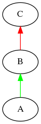

### Inheritance Diagram

### Includes
\#include "test.h"

### C Class Reference
Class C with only protected members

**Constructor**
C(int a1)

**Protected Attributes**
int var1

**Protected Member Function**
void func1(int a1)

### B Class Reference
Class B with private and public members
Private members coming from parent class C

**Constructor**
B(int a1)
B(int a1, int a2)

**Private Attributes**
int var1

**Public Attributes**
int var2

**Private Member Function**
void func1(int a1)

**Public Member Function**
void func2()

### A Class Reference
Class A with only public members

**Constructor**
A(int a1, int a2)

**Public Attributes**
int var2
int var3

**Public Member Function**
void func2()
void func3()