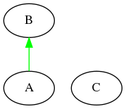

### Inheritance Diagram

### Includes
\#include\<iostream\>
\#include "test.h"

### C Class Reference
Class C doxygen comment

**Constructor**
C()

**Public Attributes**
int var1

**Public Member Function**
void func1()

### B Class Reference
Class B doxygen comment

**Constructor**
B(int a1)

**Private Attributes**
int var1

**Protected Attributes**
int var2

**Private Member Function**
void func1()

**Protected Member Function**
void func2(int a1)

### A Class Reference
Class A doxygen comment

**Constructor**
A()
A(int a1, int a2)

**Private Attributes**
int var1

**Protected Attributes**
int var2

**Public Attributes**
int var3

**Private Member Function**
void func1()

**Protected Member Function**
void func2(int a1)

**Public Member Function**
void func3(int a1, int a2)
void func4(int a1, int a2, int a3)