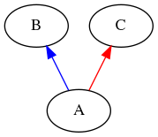

### Inheritance Diagram

### Includes
\#include\<iostream\>

### C Class Reference
Class C with only protected members

**Constructor**
C()

**Protected Attributes**
int var1

**Protected Member Function**
void func1()

### B Class Reference
Class B with only public members

**Constructor**
B(int a1)

**Public Attributes**
int var2

**Public Member Function**
void func2(int a1)

### A Class Reference
Class A with private and protected members

**Constructor**
A()
A(int a1)

**Private Attributes**
int var1

**Protected Attributes**
int var2

**Private Member Function**
void func1()

**Protected Member Function**
void func2(int a1)